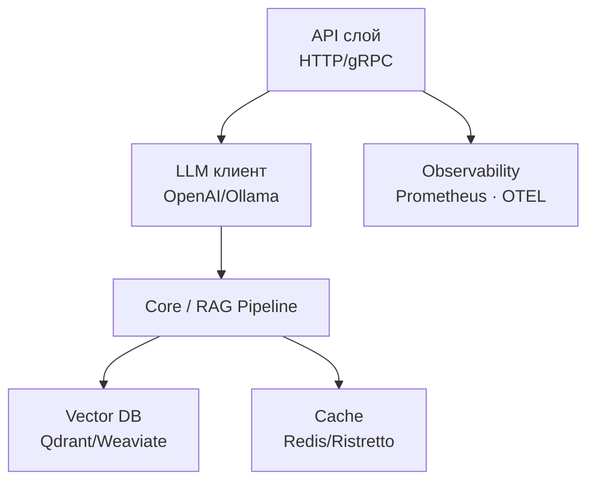

<div class="text-center text-4xl">
  Go и LLM
</div>

<div class="text-center text-2xl">
  Евгений Гребенников
</div>

<div class="abs-br m-6 flex gap-2 items-center">
  <div class="text-center text-xl flex items-center gap-1">
    {{ new Date().toLocaleDateString('ru-RU', { year: 'numeric', month: 'long', day: 'numeric' }) }}
  </div>
  <a href="https://github.com/vokinneberg/ya-practicum-go-and-llm" target="_blank" alt="GitHub" title="Open in GitHub"
    class="text-xl slidev-icon-btn opacity-50 !border-none !hover:text-white">
    <carbon-logo-github />
  </a>
</div>

---
layout: two-cols
hideInToc: true
---

## 🤗 Добро пожаловать!

- ✍️ Представьтесь в Zoom (Имя Фамилия)
- 📹 Камера по возможности
- 💬 Пишите вопросы в чат — разберём в конце

::right::

## План вебинара

<Toc minDepth="1" maxDepth="1" class="text-left" mode="all" />

---
layout: default
title: Почему Go сейчас выигрывает
---

# Почему Go сейчас выигрывает

- 🚀 Низкая латентность: goroutines, отсутствие GIL
- 🔒 Типобезопасность → меньше runtime-ошибок
- 📦 Один статический бинарник
- 🛠 Сильная стандартная библиотека (net/http, sync, pprof)

## Примеры

- OpenAI, Anthropic, Cohere — официальные Go SDK
- Cloudflare Workers AI, Elastic, Datadog
- Внутренние LLM-шлюзы (FAANG) ради производительности и простых deploy

---
layout: default
title: Экосистема
---

# Экосистема

1. **LLM клиенты:** `openai-go`, `ollama-go`, `go-anthropic`
2. **Оркестрация:** `langchaingo`, собственные pipelines, DI (wire/fx)
3. **Векторные БД:** Qdrant, Weaviate, Milvus, Pinecone
4. **Инфра:** Redis/Ristretto, Kafka/NATS, Prometheus, OTEL

**Стратегия**: начинаем с минималистичного клиента и постепенно добавляем слои.

---
layout: two-cols-header
layoutClass: gap-6 px-4
---

## OpenAI Go SDK

```go
import (
    "github.com/openai/openai-go"
    "github.com/openai/openai-go/option"
)

client := openai.NewClient(option.WithAPIKey(apiKey))

resp, err := client.Chat.Completions.New(ctx,
    openai.ChatCompletionNewParams{
        Model: openai.F("gpt-4o-mini"),
        Messages: []openai.ChatCompletionMessageParamUnion{
            openai.UserMessage("Explain Go channels"),
        },
        Temperature: openai.Float(0.2),
    },
)
```

- ✅ JSON mode, function calling, streaming
- ✅ Поддержка vision, audio, embeddings
- ⚠️ Стоимость и лимиты запросов
- ⚠️ Требует продуманного кэширования и rate limiting

---
layout: default
layoutClass: gap-6 px-4
---

## Локальные модели через Ollama

```go
import "github.com/ollama/ollama-go"

client := ollama.NewClient()

resp, err := client.Generate(ctx, &ollama.GenerateRequest{
    Model:  "llama3.1",
    Prompt: "Explain Go concurrency",
    Stream: true,
})
```

- ✅ Приватность данных, офлайн-режим, быстрые эксперименты
- ✅ Нет API-лимитов, можно fine-tune веса
- ⚠️ Производительность = ваше железо
- ⚠️ Меньше моделей, нужно обслуживать inference-стек

---
layout: two-cols-header
layoutClass: gap-6 px-4
---

## Langchaingo или свой мини-фреймворк?

**Langchaingo**
- Chains, agents, tool calling из коробки
- Интеграции с Qdrant, Pinecone, OpenAI
- Ускоряет прототипирование

**Custom**
- Тонкий контроль за latencies/cost
- Меньше абстракций → проще профилировать
- Используем интерфейсы `LLMClient`, `Retriever`, `Pipeline`

**Частый путь**: langchaingo в MVP → постепенное выпиливание в проде.

---
layout: center
title: Архитектура сервис
---

# Архитектура сервиса



---
layout: two-cols-header
layoutClass: gap-6 px-4
---

## Чёткое разделение ответственности

### LLM-клиент

```go
type LLMClient interface {
    Generate(ctx context.Context, prompt Prompt) (Answer, error)
    Stream(ctx context.Context, prompt Prompt) (<-chan Chunk, error)
    Embedding(ctx context.Context, text string) ([]float32, error)
}
```

- Инкапсулируем провайдера
- Добавляем retries, rate limiting, модерацию
- Снимаем метрики per model

### Handlers

- Валидация входа, auth, трейсинг
- Управление контекстом (timeout/cancel)
- Ответ клиенту (REST, SSE, gRPC)

Чем изолированнее слой, тем проще тестировать core без реальных API.

---
layout: two-cols-header
layoutClass: gap-6 px-4
---

## Prompts и сервисное ядро

### Храним промпты

- Файлы (`prompts/system.txt`) для MVP
- Config / Feature flag — параметризованные шаблоны
- БД — версионирование, A/B тесты

```go
type Pipeline struct {
    chunker TextChunker
    retriever VectorDatabase
    llm LLMClient
}

func (p *Pipeline) Answer(ctx context.Context, q string) (string, error) {
    emb, err := p.llm.Embedding(ctx, q)
    docs, err := p.retriever.Search(ctx, emb, 4)
    prompt := composePrompt(docs, q)
    return p.llm.Generate(ctx, prompt)
}
```

**Core**: композиция шагов, а не место для HTTP/SDK-деталей.

---
layout: two-cols-header
layoutClass: gap-6 px-4
---

## Streaming и конкурентность

```go
func (h *Handler) Stream(w http.ResponseWriter, r *http.Request) {
    ctx, cancel := context.WithTimeout(r.Context(), 30*time.Second)
    defer cancel()

    setupSSE(w)
    stream, err := h.llm.Stream(ctx, buildPrompt(r))
    if err != nil { handleErr(err); return }

    for chunk := range stream {
        fmt.Fprintf(w, "data:%s\n\n", chunk.Text)
        w.(http.Flusher).Flush()
    }
}
```

```go
func ProcessBatch(ctx context.Context, jobs []Job, workers int) []Result {
    jobCh := make(chan Job, len(jobs))
    resCh := make(chan Result, len(jobs))

    for i := 0; i < workers; i++ {
        go func() {
            for job := range jobCh {
                resCh <- handleJob(ctx, job)
            }
        }()
    }

    for _, job := range jobs { jobCh <- job }
    close(jobCh)

    var out []Result
    for range jobs { out = append(out, <-resCh) }
    return out
}
```

---
layout: two-cols-header
layoutClass: gap-6 px-4
---

## Надёжность: retry + fallback

```go
func Retry(ctx context.Context, fn func() error) error {
    var lastErr error
    for attempt := 0; attempt < 3; attempt++ {
        if err := fn(); err == nil {
            return nil
        }
        lastErr = err
        backoff := time.Duration(1<<attempt) * time.Second
        if err := sleepCtx(ctx, backoff); err != nil {
            return err
        }
    }
    return fmt.Errorf("retries exceeded: %w", lastErr)
}
```

```go
func (r *Router) Generate(ctx context.Context, q string) (string, error) {
    primary := r.primary.Generate(ctx, q)
    if primary.Err == nil { return primary.Answer, nil }

    if r.cb.Open() {
        return "", fmt.Errorf("provider unhealthy: %w", primary.Err)
    }

    fallback := r.fallback.Generate(ctx, q)
    if fallback.Err != nil {
        r.cb.Fail()
        return "", fallback.Err
    }

    r.cb.Success()
    return fallback.Answer, nil
}
```

Retry budget + circuit breaker предотвращают каскадные отказы.

---
layout: two-cols-header
layoutClass: gap-6 px-4
---

## Производительность и сеть

### HTTP/2 / HTTP/3

- Multiplexing, header compression
- Быстрый handshake → меньше latency
- В Go включается через `http2.ConfigureServer`

### Persistent connections

```go
client := &http.Client{
    Transport: &http.Transport{
        MaxIdleConns:        100,
        MaxIdleConnsPerHost: 20,
        IdleConnTimeout:     90 * time.Second,
    },
    Timeout: 30 * time.Second,
}
```

- Готовим `strings.Builder` + `sync.Pool` для сборки ответов
- Считаем токены заранее (`tiktoken-go`) → не рвём лимит
- Профилируем `net/http/pprof`: CPU, heap, goroutines
- Распараллеливаем независимые запросы через `sync.WaitGroup`

---
layout: two-cols-header
layoutClass: gap-6 px-4
---

## Кэширование и rate limiting


```go
cacheKey := fmt.Sprintf("llm:%s:%s", model, hash(query))
if cached, err := cache.Get(ctx, cacheKey); err == nil {
    return cached, nil
}

answer, err := llm.Generate(ctx, prompt)
cache.Set(ctx, cacheKey, answer, 10*time.Minute)
```

- Redis для shared cache, Ristretto — in-process
- Embeddings кэшируем почти всегда, ответы — по use-case

```go
type LimiterRegistry struct {
    mu sync.RWMutex
    users map[string]*rate.Limiter
}

func (r *LimiterRegistry) Get(user string) *rate.Limiter {
    r.mu.RLock()
    lim, ok := r.users[user]
    r.mu.RUnlock()
    if ok { return lim }

    r.mu.Lock()
    defer r.mu.Unlock()
    lim = rate.NewLimiter(10, 5)
    r.users[user] = lim
    return lim
}
```

Комбинируем глобальные лимиты провайдера + per-user квоты.

---
layout: two-cols-header
layoutClass: gap-6 px-4
title: Компоненты RAG
---

# Компоненты RAG

### Chunking

```go
type RecursiveChunker struct {
    Size, Overlap int
}

func (c *RecursiveChunker) Chunk(text string) []string {
    var chunks []string
    step := c.Size - c.Overlap
    for i := 0; i < len(text); i += step {
        end := min(i+c.Size, len(text))
        chunks = append(chunks, text[i:end])
    }
    return chunks
}
```

### Embeddings

```go
resp, _ := client.Embeddings.New(ctx, openai.EmbeddingNewParams{
    Model: openai.EmbeddingModel("text-embedding-3-large"),
    Input: openai.EmbeddingNewParamsInputUnion{
        OfString: openai.F(text),
    },
})

vec := make([]float32, len(resp.Data[0].Embedding))
for i, v := range resp.Data[0].Embedding {
    vec[i] = float32(v)
}
```

- Хешируем текст → переиспользуем результаты
- Следим за лимитами токенов при сборке контекста

---
layout: two-cols-header
layoutClass: gap-6 px-4
title: Векторные БД
---

# Векторные БД

### Qdrant

```go
client, _ := qdrant.NewClient(ctx, &qdrant.Config{
    Host: "localhost",
    Port: 6334,
})

client.CreateCollection(ctx, &qdrant.CreateCollection{
    CollectionName: "docs",
    VectorsConfig: qdrant.NewVectorsConfig(
        &qdrant.VectorParams{Size: 3072, Distance: qdrant.Distance_Cosine},
    ),
})
```

- **Weaviate** — GraphQL API, hybrid search
- **Milvus** — масштабирование + GPU
- **Elastic/OpenSearch** — sparse + dense в одном кластере
- **Pinecone** — полностью managed

**Храним payload**: `doc_id`, `source`, score.

---
layout: two-cols-header
layoutClass: gap-6 px-4
---

## RAG: ingest и retrieve


```go
func (p *Pipeline) Ingest(ctx context.Context, id, text string) error {
    chunks := p.chunker.Chunk(text)
    points := make([]*qdrant.PointStruct, 0, len(chunks))

    for i, chunk := range chunks {
        emb, err := p.llm.Embedding(ctx, chunk)
        if err != nil { return err }
        points = append(points, makePoint(id, i, emb, chunk))
    }
    return p.vector.Upsert(ctx, points)
}
```

```go
func (p *Pipeline) Answer(ctx context.Context, query string) (string, error) {
    emb, err := p.llm.Embedding(ctx, query)
    docs, scores, err := p.vector.Search(ctx, emb, p.searchLimit)
    context := buildContext(docs, scores)
    return p.llm.Generate(ctx, Prompt{
        System: systemPrompt,
        User:   fmt.Sprintf(\"%s\\n\\nВопрос: %s\", context, query),
        Format: JSONSchema,
    })
}
```

- Следим за лимитом токенов при объединении контекста
- Добавляем ссылки на источники в ответе

---
layout: two-cols-header
layoutClass: gap-6 px-4
---

## Structured output и tools


```go
type Answer struct {
    Response   string   `json:"response"`
    Confidence float64  `json:"confidence"`
    Sources    []string `json:"sources"`
}

resp, _ := client.Chat.Completions.New(ctx,
    openai.ChatCompletionNewParams{
        Model: "gpt-4o-mini",
        Messages: messages,
        ResponseFormat: &openai.ChatCompletionResponseFormatParam{
            Type: openai.F(openai.ChatCompletionResponseFormatTypeJSONObject),
        },
    })
json.Unmarshal([]byte(resp.Choices[0].Message.Content), &answer)
```

```go
tools := []openai.ChatCompletionToolParamUnion{
    openai.ChatCompletionToolParam{
        Type: openai.F(openai.ChatCompletionToolTypeFunction),
        Function: openai.FunctionDefinition{
            Name: "get_weather",
            Parameters: map[string]any{
                "type": "object",
                "properties": map[string]any{
                    "location": map[string]string{"type": "string"},
                },
                "required": []string{"location"},
            },
        },
    },
}
```

- Валидируем `go-playground/validator`
- Генерируем схемы через `invopop/jsonschema` или quicktype

---
layout: two-cols-header
layoutClass: gap-6 px-4
title: Observability
---

# Observability + тесты

```go
var llmLatency = prometheus.NewHistogramVec(
    prometheus.HistogramOpts{
        Name: "llm_request_duration_seconds",
        Help: "LLM latency",
        Buckets: prometheus.ExponentialBuckets(0.05, 2, 8),
    },
    []string{"model", "status"},
)

ctx, span := tracer.Start(ctx, "llm.generate")
span.SetAttributes(attribute.String("model", model))
defer span.End()
```

- Snapshot / golden tests для генераций
- Контроль дрейфа: baseline ответы + семантическое сравнение
- Фейковые LLM клиенты (record/replay) для unit-тестов
- Нагрузочные тесты на streaming и batch ingest

---
layout: two-cols-header
layoutClass: gap-6 px-4
title:  Практические советы
---

# Практические советы

1. **Безопасность** — модерация (OpenAI API) + собственные фильтры/санитайзинг
2. **Cost control** — глобальные и per-user лимиты, кэширование ответов, fallback на дешёвые модели
3. **Event-driven** — Kafka/NATS для batch задач, worker pools с ack/retry
4. **Prompt store** — версионирование системных сообщений, feature flags для раскатки

Чем раньше соберёте метрики и бюджет, тем дешевле эксперименты.

---
layout: default
---

## Ресурсы

- [openai/openai-go](https://github.com/openai/openai-go)
- [tmc/langchaingo](https://github.com/tmc/langchaingo)
- [qdrant/qdrant-go](https://github.com/qdrant/qdrant-go)
- [go.opentelemetry.io/otel](https://go.opentelemetry.io/otel)
- [ya-practicum-go-and-llm](https://github.com/vokinneberg/ya-practicum-go-and-llm)

---
layout: center
title: 🤔 Вопросы?
---

## Спасибо!

Вопросы? Пишите @vokinneberg в Telegram или оставляйте issue в репозитории.

<PoweredBySlidev mt-10 />
